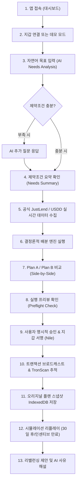

# TRON Compass 🧭
### AI Asset Allocation and Yield Planning Assistant for TRON

> **Declared Function:**  
> **TRON Compass converts a user's holdings, investment horizon, liquidity needs, and risk limits into evidence-based TRON yield plans using JustLend and USDD data, executes only user-approved actions on Nile testnet, and monitors positions for constraint-triggered rebalancing.**  
> (사용자의 보유자산·투자기간·필요 유동성·위험 한도를 AI로 정형화하고, JustLend 및 USDD 실시간 데이터를 기반으로 하드 제약을 100% 만족하는 2개 이상의 운용안을 계산하여, 사용자가 명시적으로 승인한 행동만 Nile 테스트넷에서 안전하게 실행하고 리밸런싱을 제안하는 자산 운용 어시스턴트)

---

## 1. What is TRON Compass?

**TRON Compass**는 GWDC 2026 Korea Hackathon **TRON Challenge B**의 공식 제출작입니다.

기존 DeFi 어시스턴트들이 "가장 높은 APY 상품을 무분별하게 추천"하거나 "AI의 수치 환각(Hallucination)"으로 인해 사용자 자산을 위험에 빠뜨리는 문제를 해결하기 위해 탄생했습니다.

### 🌟 핵심 설계 원칙
```text
AI understands. Code verifies. User approves. TRON executes.
```
- **AI는 이해하고 설명합니다**: 자연어 투자 의도 파악, 제약조건 누락 질의, 플랜 및 리밸런싱 사유 해설.
- **코드는 계산하고 검증합니다**: 금융 수식, 수수료, 마켓 유효성, 최소 유동성 등 하드 제약(Hard Constraints)을 결정론적 엔진으로 엄격히 강제.
- **사용자는 직접 승인합니다**: Human-in-the-loop 원칙에 따라 사용자 명시적 서명 없는 임의 트랜잭션 원천 차단.
- **TRON은 안전하게 실행합니다**: 검증된 Nile 테스트넷 스마트 컨트랙트에서 실제 트랜잭션 수행.

---

## 2. Problem & Solution

### ⚠️ 문제점 (Problem)
1. **DeFi 파편화와 높은 진입장벽**: 초보자나 일반 사용자는 JustLend의 24개 마켓, 기본 이율과 채굴 인센티브, 변동성 위험을 한눈에 파악하기 어렵습니다.
2. **AI의 금융 수치 환각 위험**: LLM에게 직접 APY나 자산 배분 계산을 맡기면 없는 컨트랙트를 창작하거나 사용자의 긴급 유동성 요구를 무시하고 전액 락업을 제안하는 치명적 실수가 발생합니다.
3. **위험한 자동 실행(Auto-trading)**: 사용자 승인 없이 백그라운드에서 임의로 자산을 전송하는 시스템은 보안상 매우 취약합니다.

### 💡 솔루션 (Solution)
1. **자연어 대화형 의도 분석**: "1,000 USDD와 약간의 TRX로 90일간 투자하되 최소 $300는 상시 인출 가능하게 해줘"와 같은 일상 언어를 구조화된 금융 제약(`NeedsProfile`)으로 변환.
2. **실시간 공식 데이터 수집 & 정규화**: JustLend OpenAPI (`lend/jtoken`) 및 USDD 공식 데이터 플랫폼에서 실시간 데이터를 수집하고, Base APY와 Mining Incentive APY를 투명하게 분리.
3. **결정론적 배분 엔진 (Deterministic Allocation Engine)**: `decimal.js` 기반 정밀 연산으로 최소 유동성 및 변동성 한도를 100% 보장하는 **Plan A (유동성 방어 우선)** 및 **Plan B (수익률 최적화)** 동시 산출.
4. **Nile 테스트넷 안전 실행 샌드박스**: 실제 자산 손실 위험 없이 Nile V1 jTRX 컨트랙트(`TKM7w4...i1pq`)와 상호작용하는 안전한 서명 흐름 제공.
5. **히스토리컬 리플레이 & 리밸런싱 감지**: 계획 수립 당시의 가정을 저장하고, 30일 경과 또는 인센티브 소멸 시 리밸런싱을 감지하여 안전한 대안 제안.

---

## 3. Selected Challenge

- **대회**: GWDC 2026 Korea Hackathon (Ecosystem Partner: TRON DAO)
- **과제**: **TRON Challenge B — Build an AI Asset Allocation and Yield Planning Assistant for TRON**
- **제출 저장소**: [https://github.com/JongHyun070105/tron-compass](https://github.com/JongHyun070105/tron-compass)

---

## 4. User Workflow



---

## 5. Architecture

```text
┌────────────────────────────────────────────────────────────────────────┐
│                      Next.js Responsive Web UI                         │
│   Dashboard  |  AI Planner  |  Plan Comparison  |  Execution  | Replay  │
└───────────────────┬──────────────────────────────────┬─────────────────┘
                    │ (Client Island)                  │ (HTTP / React Query)
                    ▼                                  ▼
      ┌───────────────────────────┐      ┌───────────────────────────────┐
      │   TronWallet Adapter      │      │        Next.js Route BFF      │
      │   (TronLink / Nile)       │      │   /api/ai/needs               │
      └─────────────┬─────────────┘      │   /api/market/justlend        │
                    │                    │   /api/market/usdd            │
                    ▼                    │   /api/allocation/plan        │
      ┌───────────────────────────┐      └──────────────┬────────────────┘
      │   TronWeb Nile Signer     │                     │
      │   (User Signature Gate)   │                     │
      └─────────────┬─────────────┘                     ▼
                    │                    ┌───────────────────────────────┐
                    ▼                    │   External Data Ingestion     │
        TRON Nile Testnet                │   - JustLend OpenAPI / contracts  │
      (Execution & Receipts)             │   - USDD Data Platform            │
                                         └──────────────┬────────────────┘
                                                        │
                                                        ▼
                                         ┌───────────────────────────────┐
                                         │  Deterministic Allocation     │
                                         │  - Hard Constraint Filter     │
                                         │  - Decimal.js Yield Engine    │
                                         │  - Plan A (Liquidity-First)   │
                                         │  - Plan B (Yield-Oriented)    │
                                         └──────────────┬────────────────┘
                                                        │
                                                        ▼
                                         ┌───────────────────────────────┐
                                         │     IndexedDB Persistence     │
                                         │     - Needs, Plans, Snapshots │
                                         │     - Replay & Rebalance Log  │
                                         └───────────────────────────────┘
```

---

## 6. Why AI vs Deterministic Engine are Separated

금융 애플리케이션에서 가장 중요한 가치는 **정확성, 안전성, 재현성**입니다.

| 영역 | AI (LLM) 역할 | 결정론적 엔진 (Code) 역할 |
|---|---|---|
| **역할 정의** | 언어 이해 및 사용자 커뮤니케이션 | 수학적 계산 및 제약 검증 |
| **담당 작업** | - 자연어 요구사항 파악<br>- 누락 필드 파악 및 질문 생성<br>- 플랜 선택 이유 친절 해설<br>- 리밸런싱 트리거 원인 설명 | - 실시간 APY 및 TVL 정규화<br>- 하드 제약조건(최소 유동성, 변동성 상한) 검증<br>- 포트폴리오 비중 최적화<br>- 복리 수익률 및 수수료 정밀 계산 |
| **안전 보장** | 숫자를 임의로 창작하지 못하도록 차단 | 1원 단위까지 `decimal.js`로 부동소수점 오차 없이 계산 |

---

## 7. JustLend Integration

공식 JustLend DAO 프로토콜의 Machine-Readable Source of Truth를 완벽하게 준수합니다.

- **데이터 수집 엔드포인트**: `GET https://openapi.just.network/lend/jtoken`
- **검증된 마켓 현황**: 24개 메인넷 jToken 중 레거시/일시정지 마켓 6개(`jUSDCOLD`, `jUSDDOLD`, `jBUSDOLD`, `jSUNOLD`, `jUSDJ`, `jWBTT`)를 자동 필터링하여 18개 활성 마켓만 추적.
- **Base APY vs Incentive APY 분리**:
  - `supplyRate`: 순수 마켓 대출 이자율 (알고리즘 기반 변동 이율)
  - `incentiveApy`: 생태계 채굴 보상 풀 (USDD 3.2%, USDT 1.5%)을 분리 표기하여 투명성 보장.
- **Nile 테스트넷 컨트랙트**:
  - `jTRX`: `TKM7w4qFmkXQLEF2MgrQroBYpd5TY7i1pq` (Underlying: Native TRX, 8 decimals)
  - `Comptroller (Unitroller)`: `TJUCStq3WqfKqZLuZje5v7z6Ua6iBry1P6`
  - ABI: jTRX의 payable `mint()` 시그니처를 호출하여 안전한 네이티브 TRX 예치 실행.

---

## 8. USDD Integration

USDD를 단순한 토큰 이름으로 사용하지 않고 공식 데이터 플랫폼 및 리스크 아키텍처를 연동했습니다.

- **데이터 출처**: `https://app-api.usdd.io/data-platform/overview/info` 및 `latest-collateral?chain=tron`
- **실시간 프로토콜 메트릭**:
  - 총 공급량: **$1,532.33M**
  - 총 담보 가치: **$2,266.24M**
  - 담보 비율: **147.89%** (안전한 초과 담보 상태 검증)
- **PSM (Peg Stability Module)**:
  - 컨트랙트: `TUajR7CbXU6hX8n3XtNkitFAD25JvP99K6`
  - 기능: USDD와 USDT 간 1:1 무슬리피지(0% Swap Fee) 상호 교환 보장.
- **담보 금고(Vault)**: `TRX-A` (249.2%), `TRX-B` (256.1%) 등 주요 TRON 기반 담보 금고의 건전성을 대시보드에 실시간 반영.

---

## 9. Mainnet Insight vs Nile Execution

데이터 왜곡을 방지하기 위해 네트워크를 명확히 분리하여 운영합니다:

```text
Market Data: TRON Mainnet (Read-Only)
Execution: Nile Testnet (Sandbox)
```

1. **Mainnet Insight Mode**:
   - 실시간 메인넷 JustLend 마켓 풀과 USDD 담보 데이터를 조회하여 가장 정확하고 현실적인 자산 배분 계획을 수립합니다. 메인넷에 대한 임의 write 트랜잭션은 차단됩니다.
2. **Nile Execution Mode**:
   - 사용자가 실제 지갑으로 서명하고 트랜잭션을 경험할 수 있도록 Nile 테스트넷에서 동작합니다.
   - 검증된 V1 jTRX 컨트랙트를 대상으로 트랜잭션을 브로드캐스트하고 온체인 트랜잭션 해시와 영수증을 제공합니다.

---

## 10. Human-in-the-loop Safety

- **Non-Custodial**: 개인키, 시드 문구는 앱에 절대 입력하거나 저장하지 않습니다.
- **사전 실행 게이트 (Preflight Check)**:
  1. 지갑 연결 여부 확인
  2. 활성 네트워크(Nile Testnet) 일치 여부 확인
  3. 예치 수량 + 에너지 수수료 버퍼(최소 20 TRX) 충족 여부 확인
- **명시적 승인 체크박스**: 사용자가 대상 컨트랙트 주소와 수량을 직접 확인하고 체크박스를 활성화해야만 서명 요청 버튼이 활성화됩니다.
- **지갑 팝업 서명**: 브라우저 확장형 TronLink 지갑의 표준 서명 팝업을 통해서만 트랜잭션이 서명됩니다.

---

## 11. Yield Calculation Assumptions

금융 계산은 `decimal.js`를 사용하여 높은 정밀도(40자리)로 수행됩니다.

### 연간 복리 수익 추정 공식
$$Y = P \times \left( (1 + \text{APY})^{\frac{H}{365}} - 1 \right)$$
- $P$: 예치 원금 (USD)
- $\text{APY}$: 연간 수익률 (Base APY + Incentive APY)
- $H$: 투자 기간 (Horizon in Days)

### 순수익 및 실효 순 APY 계산
$$\text{Net Yield (USD)} = \text{Base Yield} + \text{Incentive Yield} - (\text{Entry Cost} + \text{Exit Cost})$$
$$\text{Effective Net APY} = \left( 1 + \frac{\text{Net Yield}}{P} \right)^{\frac{365}{H}} - 1$$

---

## 12. Historical Replay & Rebalancing

해커톤 시연에서 30일을 실제로 기다릴 필요 없이, 검증된 시뮬레이션 시나리오를 통해 리밸런싱 루프를 체험할 수 있습니다.

### 리플레이 시나리오
1. **Scenario 1: JustLend Mining Incentive Halving / Expiry (Day +30)**
   - 30일 경과 후 거버넌스 정책으로 jUSDD 인센티브(3.2%)가 소멸하는 시나리오.
   - 예상 수익률 급감(> 30%) 감지 → 결정론적 리밸런싱 트리거 발동 → 신규 추천 플랜 제시 및 AI 해설.
2. **Scenario 2: Emergency Withdrawal & Liquidity Shortfall**
   - 긴급 출금으로 인해 지갑 가용 유동성이 최소 안전선($300) 아래로 하락하는 시나리오.
   - 유동성 결손 감지 → 일부 포지션 즉시 상환(Redeem) 및 유동성 회복 제안.

---

## 13. How to Run

### 사전 준비
- Node.js >= 20 (권장: Node.js v23.6.0)
- pnpm >= 10 (권장: pnpm v12.6.0)

### 설치 및 구동
```bash
# 1. 의존성 설치
pnpm install

# 2. 단위/통합 테스트 실행 (31개 테스트 전원 통과)
pnpm test

# 3. TypeScript 타입 체크
pnpm typecheck

# 4. ESLint 린트 검사
pnpm lint

# 5. 프로덕션 빌드
pnpm build

# 6. 프로덕션 서버 실행
pnpm start
# -> http://localhost:3000 접속
```

---

## 14. Environment Variables

`.env.example` 템플릿을 복사하여 `.env.local`을 생성합니다:

```bash
cp .env.example .env.local
```

### 설정 항목
```ini
# Google Gemini API Key (Server-side AI analysis and explanation)
GEMINI_API_KEY=your_gemini_api_key_here

# TRONGrid API Key (Server-side high rate limit node access)
TRONGRID_API_KEY=your_trongrid_api_key_here

# Public network setting for client initialization (mainnet | nile)
NEXT_PUBLIC_DEFAULT_NETWORK=nile
```

> **보안 주의사항**: `.env.local`은 `.gitignore`에 등록되어 있으며, API 키는 절대 클라이언트 브라우저 번들에 노출되지 않고 Next.js Route Handler 내에서만 안전하게 사용됩니다. 키가 없는 환경에서도 `MockLLMProvider`로 완벽하게 폴백 동작합니다.

---

## 15. 3-Minute Demo Flow

| 시간 | 화면 | 시연 내용 |
|:---:|:---|:---|
| **0:00–0:20** | **대시보드 & 마켓 현황** | 앱 접속 후 `Market Data: TRON Mainnet` / `Execution: Nile Testnet` 배지 확인. JustLend 24개 마켓의 Base/Incentive APY 분리 및 USDD 담보비율 147.89% 실시간 데이터 확인. |
| **0:20–0:50** | **AI 플래너 (Needs)** | 프리셋 클릭: *"I have 1,000 USDD and some TRX. I want to invest for about 90 days, but at least $300 must remain liquid. I prefer low risk."* → AI가 의도를 파악하여 확정된 제약 조건 카드(Needs Summary) 생성. |
| **0:50–1:30** | **플랜 비교 (Plan A/B)** | 결정론적 엔진이 산출한 **Plan A (유동성 방어 우선)** vs **Plan B (수익률 최적화)** 비교. 하드 제약조건 체크리스트(녹색 체크마크) 및 AI 추천 해설 확인. |
| **1:30–2:10** | **Nile 실행 프리뷰 & 서명** | Nile 실행 대상인 jTRX 선택 → Preflight 3개 조건 검증 → 상세 명세 및 수수료 확인 → 사용자 명시적 승인 체크 → 서명 및 브로드캐스트 → Nile TronScan 링크 확인. |
| **2:10–2:40** | **히스토리컬 리플레이** | 모니터링 탭 이동 → *[Replay: Day +30 Incentive Expiry]* 버튼 클릭 → 30일 경과 후 인센티브 소멸에 따른 기대 수익률 급락 시뮬레이션. |
| **2:40–3:00** | **리밸런싱 제안 & 결론** | 시스템이 APY 하락을 자동 감지하고 신규 최적 플랜과 AI 조언을 제안. 핵심 슬로건: *"AI understands. Code verifies. User approves. TRON executes."* |

---

## 16. Challenge Acceptance Criteria Mapping

| Challenge B 요구사항 | TRON Compass 구현 상태 | 증거 및 검증 위치 |
|:---|:---|:---|
| **Natural-language Needs Analysis** | ✅ 완료 | 대화형 입력, 누락 필드 질의, Zod 기반 `NeedsProfile` 구조화 (`/api/ai/needs`) |
| **JustLend Real Integration** | ✅ 완료 | 공식 OpenAPI (`lend/jtoken`) 실시간 수집 및 contracts.json 매핑 (`/api/market/justlend`) |
| **USDD Real Integration** | ✅ 완료 | USDD 데이터 플랫폼 개요, 담보비율(148%), PSM 1:1 연동 (`/api/market/usdd`) |
| **At least 2 Viable Plans** | ✅ 완료 | Plan A (Liquidity-First) & Plan B (Yield-Oriented) 결정론적 산출 (`/api/allocation/plan`) |
| **Base vs Incentive Yield Separation** | ✅ 완료 | 모든 플랜 및 카드에서 Base APY, Incentive APY, Fee, Net APY 엄격 분리 |
| **User Confirmation Gate** | ✅ 완료 | Preflight 점검, 트랜잭션 명세 고지, 명시적 승인 체크박스 (`ExecutionModal`) |
| **TRON Execution** | ✅ 완료 | Nile 테스트넷 jTRX mint payable 트랜잭션 빌드, TronLink 서명 및 영수증 확인 |
| **Persistence & Tracking** | ✅ 완료 | 최초 수립 시점의 스냅샷, 제약조건, 가정을 로컬 저장소(IndexedDB)에 보존 |
| **Historical Replay / Rebalance** | ✅ 완료 | 30일 후 인센티브 소멸/유동성 부족 시나리오 리플레이 및 결정론적 리밸런싱 트리거 |
| **Build & Quality Gates** | ✅ PASS | `lint`, `typecheck`, `test (31/31)`, `build` 전원 통과 |

---

## 17. Limitations & Future Work

### 인지된 제약사항 (Known Limitations)
1. **JustLend V2 Vault Nile 미배포**: V2 Moolah ERC-4626 Vault는 Nile 테스트넷에 미배포 상태이므로, Nile 실행은 검증된 V1 core jToken(jTRX)을 타겟으로 합니다.
2. **Mainnet Write 차단**: 안전을 위해 메인넷 온체인 write는 원천 차단되며, 실시간 데이터 인사이츠로만 동작합니다.
3. **지갑 팝업 서명 의존**: Web3 비수탁 지갑 보안 원칙상 최종 트랜잭션 브로드캐스트는 사용자의 지갑 팝업 확인이 필수적입니다.

### 향후 로드맵 (Future Work)
- **JustLend V2 메인넷 연동 확장**: V2 거버넌스 및 Moolah 아이솔레이티드 풀 완제 연동.
- **다중 자산 복합 실행 번들링**: 한 번의 사용자 승인으로 여러 마켓에 분산 예치하는 멀티콜(Multicall3) 파이프라인 구축.
- **실시간 온체인 오라클 리스너**: 체인로그 및 이벤트 서버를 통한 실시간 이율 변동 웹소켓 푸시 알림.
