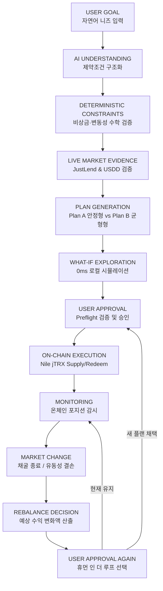

# TRON Compass — 의사결정 및 실행 루프 아키텍처 (Decision Loop Architecture)

> **핵심 제품 원칙 (Core Product Principle)**
> 
> **AI understands. Code verifies. User approves. TRON executes.**
> (AI는 이해하고, 코드는 검증하며, 사용자는 승인하고, TRON은 실행합니다.)

---

## 1. 개요 (Overview)

TRON Compass는 단순한 "DeFi 통계 대시보드"나 "환각을 유발하는 AI 챗봇"이 아닙니다.  
사용자의 재무적 제약 조건을 정확히 해석하고, 수학적/결정론적 규칙으로 계획의 타당성을 증명하며, 오직 사용자가 명시적으로 승인한 작업만을 실제 TRON 온체인에서 안전하게 실행하는 **지능형 의사결정 및 실행 시스템(Decision & Execution System)**입니다.

---

## 2. 역할과 책임의 엄격한 분리 (Separation of Concerns)

TRON Compass는 각 구성 요소의 책임을 명확히 구분하여 신뢰성과 안전성을 보장합니다:

| 역할 | 담당 주체 | 책임 및 한계 | 금지 사항 |
| :--- | :--- | :--- | :--- |
| **이해 (Understand)** | **Gemini 2.5 Flash / Mock Fallback** | 사용자의 비정형 자연어 입력에서 운용 기간, 필수 비상금, 위험 성향, 특정 보호 조건을 추출하여 5개 정형 필드로 구조화 | **재무 수치 창작 금지**, 배분 금액 임의 계산 금지, 실행 명령어 직접 발송 금지 |
| **검증 (Verify)** | **결정론적 배분 & 수학 엔진 (TypeScript/SafeMath)** | 1. 비상금 100% 보존 검증 2. 변동성 자산 한도 초과 차단 3. USDD 준비금 담보율 시그널 평가 4. What-If 즉각 재계산 (0ms, Zero AI) 5. 리밸런싱 손익 변동액 계산 | 휴리스틱 추측 금지, Float 오차 배제 (`Decimal.js`), 검증 없는 통과 금지 |
| **승인 (Approve)** | **사용자 (Human-in-the-Loop)** | 1. 구조화된 조건 확인 및 수정 2. 플랜 비교 검토 3. 4단계 Preflight 체크 결과 승인 4. 지갑 서명 팝업 최종 승인 5. 리밸런싱 제안 시 채택 여부 선택 | 강제 서명 요청 금지, 다크 패턴 금지 |
| **실행 (Execute)** | **TronLink & TRON Nile Testnet** | 1. 사용자가 서명한 트랜잭션 브로드캐스트 2. JustLend `mint()` (Supply) 실행 3. JustLend `redeem()` (Redeem) 실행 | 백그라운드 무단 트랜잭션 금지, 네트워크 불일치 시 트랜잭션 차단 |
| **추적 (Monitor)** | **TronGrid OpenAPI & Client** | 1. 온체인 블록 및 영수증(Receipt) 조회 2. 실제 소모된 `energy_fee`, `net_fee` 측정 3. 트랜잭션 최종 확정(CONFIRMED) 증명 | 임의 완료 판정 금지, TronGrid 검증 없는 성공 처리 금지 |

---

## 3. 8단계 엔드투엔드 의사결정 루프 상세

### Step 1. 사용자 자연어 목표 입력 (User Natural Language Input)
- 사용자는 일상 언어로 자신의 상황과 제약 조건을 입력합니다.
- *예시: "3개월 정도 굴릴 건데 다음 달 여행비 300달러는 무조건 남겨두고 싶고 코인은 많이 흔들리는 건 싫어."*

### Step 2. AI 제약조건 구조화 및 명시적 확인 (AI Understanding)
- Gemini는 자연어를 파싱하여 5개 핵심 제약으로 정형화합니다:
  - 운용 기간: `90일`
  - 필수 유동성(비상금): `$300`
  - 위험 성향: `LOW (보수적)`
  - 최대 변동성 노출 한도: `20%`
  - 보호 조건: `여행비 $300은 운용 대상에서 제외`
- UI는 "제가 이렇게 이해했어요" 전용 카드를 통해 사용자에게 AI의 해석 결과를 투명하게 보여주고, 사용자가 직접 `[수정하기]` 또는 `[이대로 계산하기]`를 누를 수 있습니다.

### Step 3. 결정론적 배분 플랜 및 What-If 탐색 (Deterministic Planning & What-If)
- 프로필이 확인되는 즉시(1ms 미만) 결정론적 엔진이 두 가지 대안을 생성합니다:
  - **Plan A (안정형 - Liquidity-First)**: 비상금 우선 확보, 저위험 코어 렌딩 풀 배분.
  - **Plan B (수익형 - Yield-Oriented)**: 안전 마진 준수 하에 JustLend 생태계 인센티브 배분.
- **인터랙티브 What-If 제어**:
  - 유동성 슬라이더($100 ~ $800), 위험 성향 버튼, 기간을 조작하면 **Gemini API 호출 없이(Zero AI)** 브라우저 로컬에서 즉시 0ms 레이턴시로 두 플랜이 실시간 재계산됩니다.
  - 비상금을 100%로 설정하면 자산 배분액이 정확히 $0이 되며 100% 무위험 보존됩니다.

### Step 4. 시장 증거 및 실행성 판별 (Live Market Evidence & Executability)
- **USDD 연동 결정론**:
  - TRON DAO Reserve 실시간 담보율을 평가하여 $\ge 130\%$는 HEALTHY, $110\% \sim 129.9\%$는 CAUTION(안정형 플랜 편입 제한), $< 110\%$는 CRITICAL(모든 신규 배분 차단)로 안전 방어합니다.
- **명시적 실행성 구분**:
  - `NILE_EXECUTABLE`: Nile 테스트넷에 배포된 검증된 컨트랙트(jTRX Supply/Redeem)로 직접 트랜잭션 실행 가능.
  - `LIVE_DATA_ONLY`: 메인넷 JustLend 공식 OpenAPI의 실시간 APY 데이터를 반영한 모의 분석 대상.

### Step 5. 사전 비행 검증 및 사용자 최종 승인 (Preflight & Approval)
- 실행 모달 진입 시 자동으로 4단계 엄격한 온체인 사전 검증(Preflight)을 수행합니다:
  1. `WALLET_CONNECTED`: TronLink 지갑 주소 연결 확인
  2. `NETWORK_NILE`: 활성 네트워크가 Nile Testnet인지 검증
  3. `BALANCE_SUFFICIENT`: 공급 시 TRX 잔고, 상환 시 jTRX 보유량 확인
  4. `ENERGY_FEE_BUFFER`: 트랜잭션 수수료용 TRX 버퍼(>= 20 TRX) 확보 확인
- 4가지 검증이 100% 통과하기 전에는 서명 버튼이 비활성화되며, 사용자가 `[승인 및 TronLink 서명]` 버튼을 직접 눌러야만 지갑 서명 창이 열립니다.

### Step 6. 온체인 실행 (On-Chain Execution)
- Supply 모드: JustLend jTRX 컨트랙트(`TKM7w4qFmkXQLEF2MgrQroBYpd5TY7i1pq`)의 `mint()` 호출.
- Redeem 모드: jTRX 컨트랙트의 `redeem(uint256)` 호출 (8 decimals 기반 정밀 변환).
- 브로드캐스트 즉시 생성된 실제 트랜잭션 해시를 반환합니다.

### Step 7. TronGrid 검증 및 온체인 포지션 모니터링 (Receipt Verification)
- 서버 측 TronGrid Client가 트랜잭션 영수증을 폴링하여 실행 성공(`SUCCESS`) 및 소모된 에너지/수수료(`fee`, `energy_fee`)를 정확히 측정하여 기록합니다.

### Step 8. 시장 변화 감지 및 리밸런싱 제안 (Market Change & Rebalance)
- 시장 상황 변화(예: USDD 인센티브 종료 또는 비상금 기준선 훼손) 감지 시:
  - "시장 상황이 바뀌었어요" 경고 카드가 활성화됩니다.
  - 기존 플랜의 예상 수익 저하액(`originalExpectedReturnUsd`), 새 플랜 적용 시 예상 수익(`newExpectedReturnUsd`), 수익 변동률(`deltaReturnPct`, 예: -31.3%)을 정량 시각화합니다.
  - **절대 자동 실행되지 않으며**, 사용자가 `[현재 플랜 유지]` 또는 `[새 플랜 채택 및 전환]`을 선택할 때만 반영됩니다.

---

## 4. 핵심 안전 보장 (Guarantees)

1. **No Hallucination in Finance**: AI는 사용자의 요구 조건을 이해하는 언어적 인터페이스일 뿐, 자산 배분 비중, 예상 수익률, 계약 주소 등 모든 재무 수치는 순수 TypeScript 코드로만 계산됩니다.
2. **Fail-Closed Principle**: 네트워크 불일치, 잔고 부족, USDD 담보율 위험, 지갑 미연결 시 시스템은 즉시 안전 모드로 전환되어 모든 실행을 중단합니다.
3. **No Autonomous Execution**: 사용자의 명시적 트랜잭션 승인 없이는 어떠한 자산 이동도 일어나지 않습니다.
